*Intentional, Interconnected Urban Living*

## The Invitation
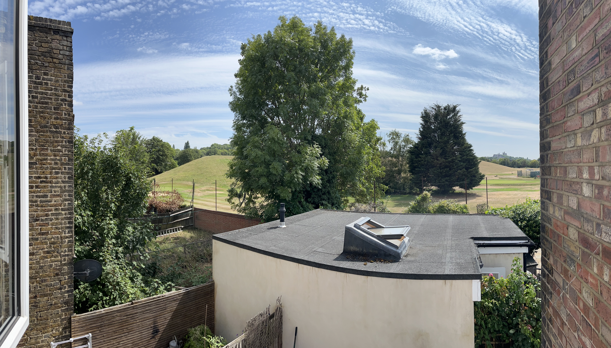
To create a warm, connected and peaceful homeshare built upon a shared understanding of the limitless potential of the human heart and a desire to build long-term, growth-oriented relationships and community in the modern age.

As humans, the quality of our relationships *is* the quality of our lives, so I want this home to be the ground for meaningful connections that go beyond sharing the same space.

This offering is for two passionate, driven humans who see that living - especially in London - is done best as a group committed to it's overall wellbeing, rather than individuals sharing a space and not much else!

## The Space

I have secured a beautiful, bright two-story maisonette in leafy South-East London, just a few minutes walk from Peckham Rye, Nunhead Cemetery and London's first community owned pub, the Ivy House.

It balances gorgeous scenery with classic London life. We back onto a golf-course / reservoir that feels like the countryside, yet have shops and regular buses out the front. I've already met the neighbours on both sides; they are warm and welcoming. It feels like home.

I'm also excited to share that we've already been adopted by the neighbour's cat!

### First Floor

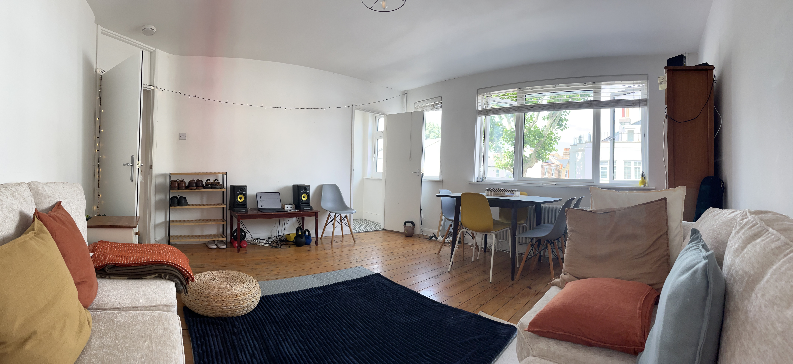A bright living room fit for relaxation and revelry

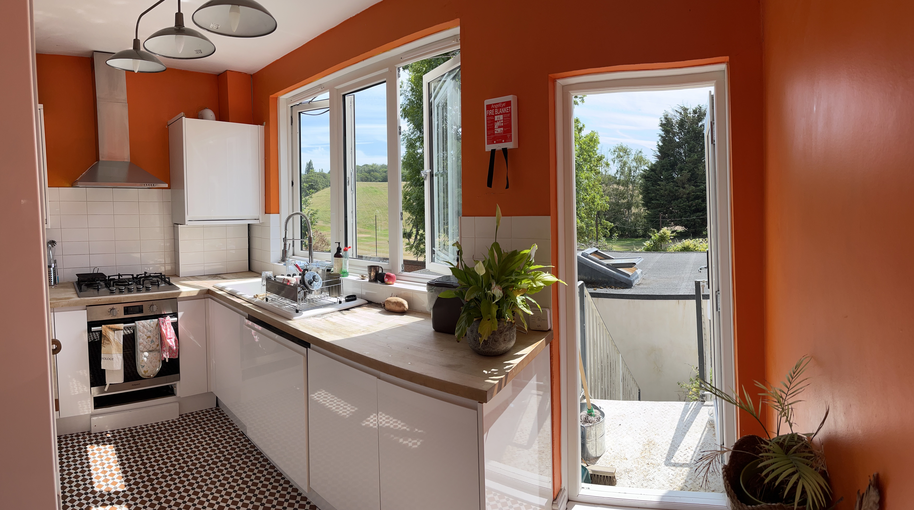A kitchen leading down to a cute patio garden

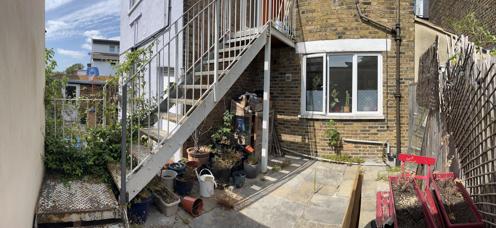Which connects to our neighbour’s, and they are open to shared gardening projects

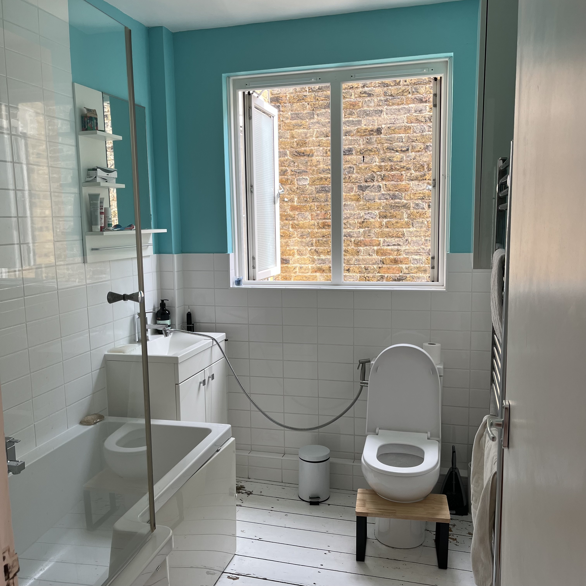The shared bathroom, also the main bathroom for two rooms: Den & Nest

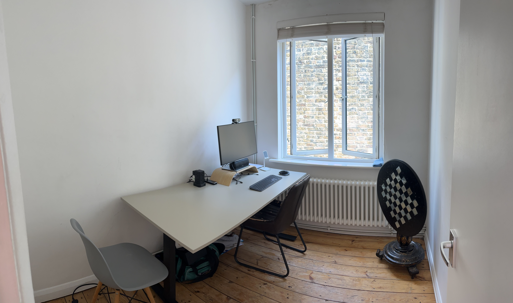
A two-person office, primed for co-working

I have furnished these rooms but, as we know, perfection is a process and changes are welcome!

### Second Floor

The two available rooms, Nest & Vista, both sit the back of the house with a tranquil, restorative views and plenty of light.

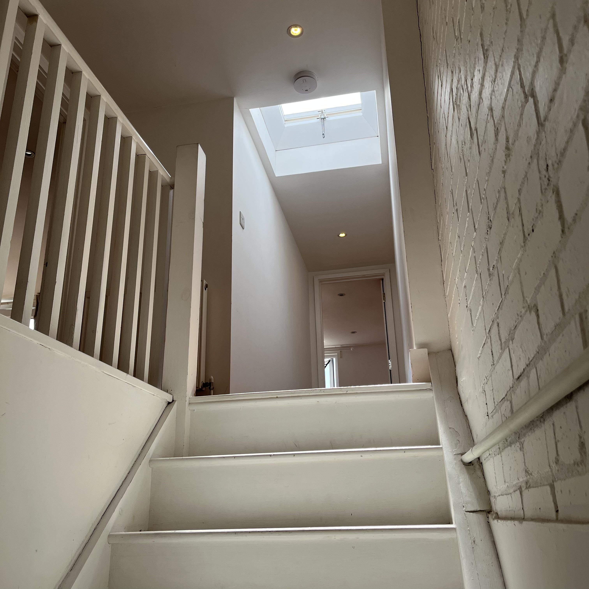

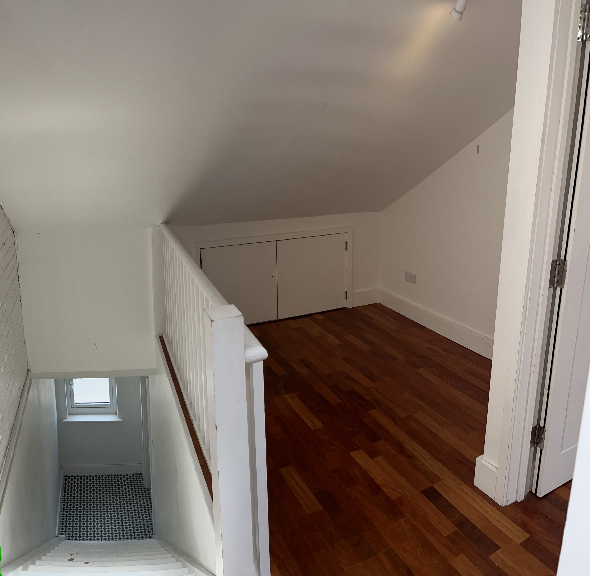
They are accessed through stairs from the living room via the Nook: a perfect space for reading, lounging and cuddling where I plan to lay tatami. Plus there is tons of attic space for storage!

## Rooms & Pricing

The entire rent is £3,400 pcm, which I have divided between:

### Vista (Large Ensuite Double): £1350

- Best view in the house
- Ensuite with shower (low ceiling warning!)
- Huge built-in cupboard
- Optional: Double bed and mattress

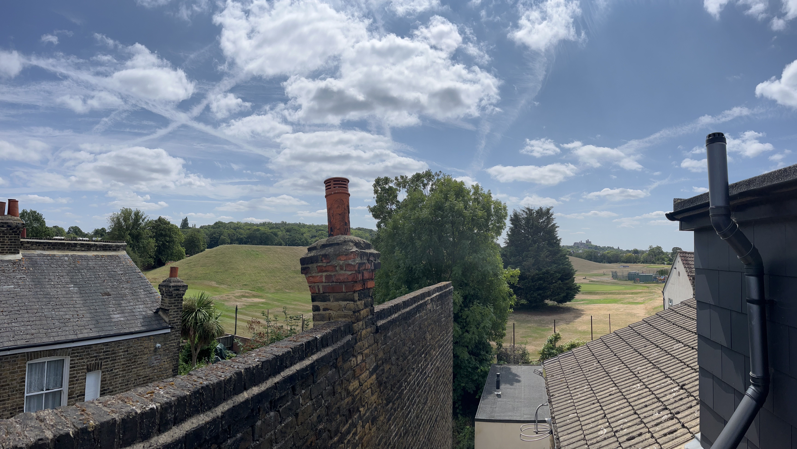

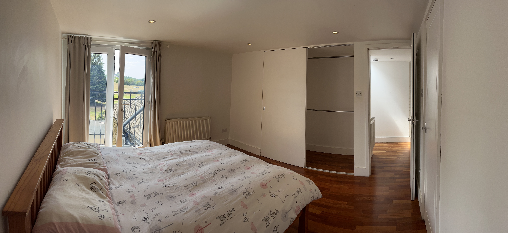

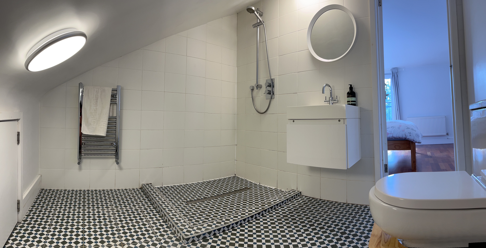

### Nest (Small Double): £900

- Great view and light
- Built-in storage
- Unfurnished, but items can be salvaged from other rooms, or negotiated
- A doorway into attic Narnia

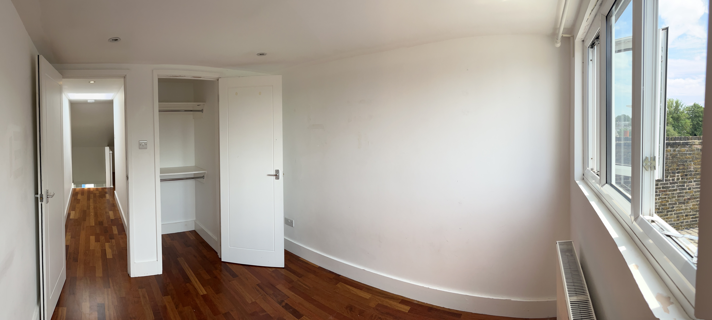

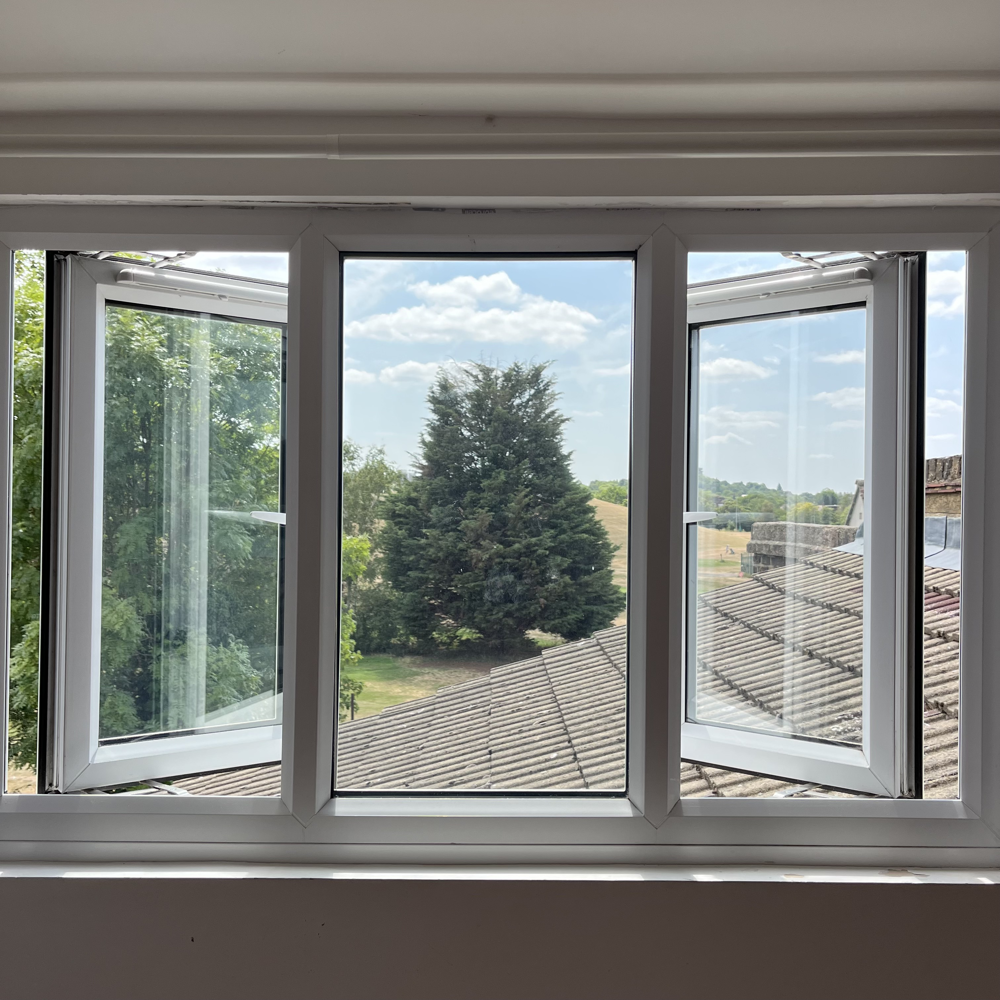

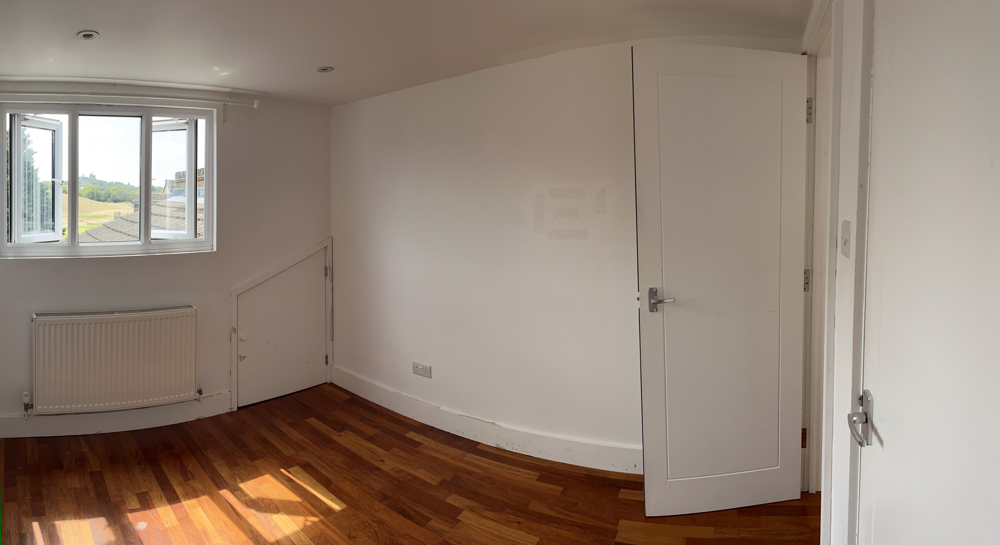

### Den (Large Double): £1150 - TAKEN

- Josh's room on the first floor
- Contains the most built-in storage, which I am opening to sharing

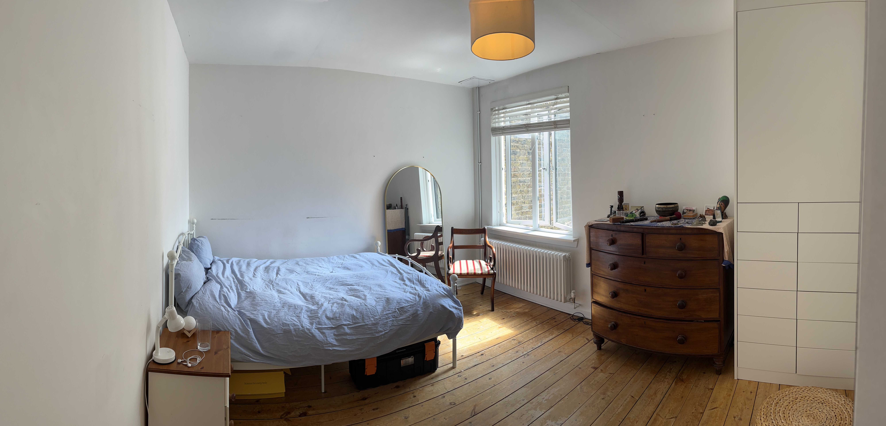

### Location  & Transport

~ 2 minutes walk:

- Bus: (N)343, 484 - on the doorstep
- Loads of e-bikes on the street
- Garage storage for bikes available

~ 15 minutes walk: Honor Oak Park, Nunhead

~ 20 minutes walk: Peckham Rye

## Principles

I have been working on some founding principles for the house. Here's what I've got so far; I'd love to build on them together:

1. Initiate collaboration
2. Clear, loving communication
3. Cultivate mindfulness
4. Take care of yourself, each other and the space
5. Support individual freedom
6. Peacefully resolve conflicts
7. Engage locally

## Plans

He are the kinds of activities I'd love to co-create:

- Weekly Meal(s) & check-in
- Jams: parks / movement / creativity / music / art
- Local community engagement
- Movie nights
- Boardgames
- Gardening: raised beds, herbs, vegetables
- Fermentation
- Trips: festivals / wild camping / hikes
- Hosting friends & family

## About Me

I'm Josh (35) and I'm passionate about building a world where we find our way out of suffering by releasing patterns of thought and behaviour that do not serve us.

I moved back to London in 2025 after almost 9 years abroad (Thailand, Vietnam, Indonesia, Nepal) where I cultivated a joyful and mindful approach to life based in community. Some highlights:

- Remote software development & English language teaching
- Facilitated touch-positive community events grounded in consent, self-awareness and somatics
- Trained in somatic and symbolic approaches to emotional health and growth
- Performed in an improv theatre troop
- Ran on a record label / events company
- Released a hip-hop EP with a friend: rapping and producing
- Yoga teacher training
- Created promotional material (interviews, biographies, recipes) for a Nepali nutrition project
- Volunteered on some European permaculture projects
- Lots of language learning, sea salt, waterfalls and jungles

I am now CTO of a start-up trading firm founded by a life-long friend and travelling companion. Since returning home I have been rebuilding my roots with local friends and communities: Yoga, Ecstatic Dance, Gloryville, sauna & ice...

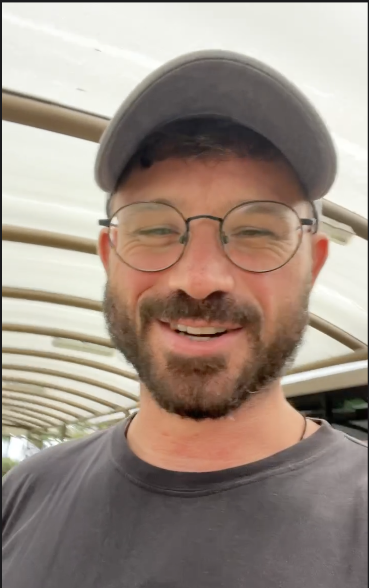

## Practicalities

- The landlord wants to reference anyone who would join the property. As such I think a minimum commitment of 6 months is necessary.
- For cyclists, I have rented space in a neighbour's garage, and I'm sure we can fit extra bikes in there.
- I have a cleaner that comes on Fridays to clean and share a lunch, which you're invited to join! She's part of the family, but only speaks Spanish.
- Resource sharing (e.g. shopping) is something to work out, I think some communal meals are a good place to start
- Bill breakdowns incoming...
